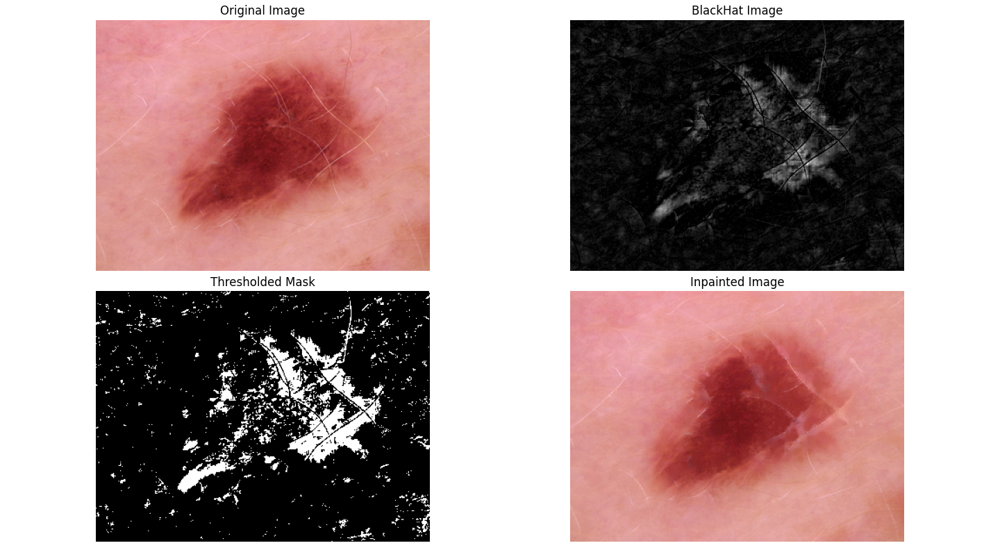
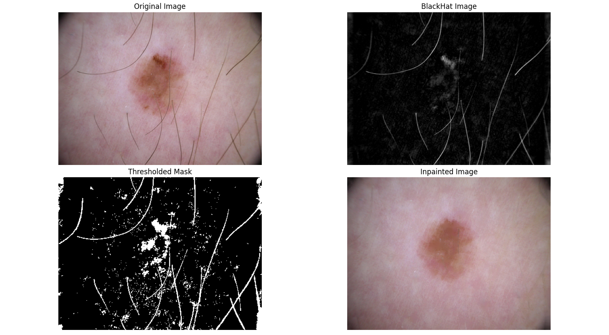

# Projects in Data Science (2025)
We were given a dataset of 100 images of skin lesions to process and clean. First step of processing was manually annotating each image by multiple annotators based on the clarity of image. In this case, it was numbering the images from 0-2, depending on the amount of hair in the image. Later we implemented a function for hair removal, that we looped through our whole dataset, which would give us the processed images without any hair. That could be later used for tasks such as detecting cancerous lesions with an algorithm. As per hair removal, we got better and worse results, which you can see in the example images here.

The image above contains light colored hair, which the algorithm responsible for hair removal does not know exactly how to deal with, resulting in blurred skin lesions.

The image above shows the skin lesion very clearly without any trace of hair left. That could be associated with the hair being very dark and also fairly scarce. 

Thinking about this problem, if we wanted to improve our algorithm and make it faster, we could implement a function that would iterate through our csv file of annotated images and output only the images that were labeled as 1 or 2, ignoring the images that were not containing any hair in the first place.

In this mandatory assignment, we learned about image processing and cv2 library, as well as collaboration on GitHub.

COMMENTS ABOUT THE CODE

1 We started by importing the needed tools to work with files, edit images, and show results.

2 Then, we made a function to go through all images in a folder and remove hair from them.

3 We checked if an output folder was given, and if so, we made sure it existed before saving anything.

4 Next, we looked at each file in the folder and made sure it was an image before working on it.

5 We opened each image in both color and black-and-white versions, skipping any that couldn’t be loaded.

6 After that, we used a special method to find and remove hair from the images using filters and masks.

7 Finally, if we wanted, we displayed the original and cleaned-up images side by side to compare them.